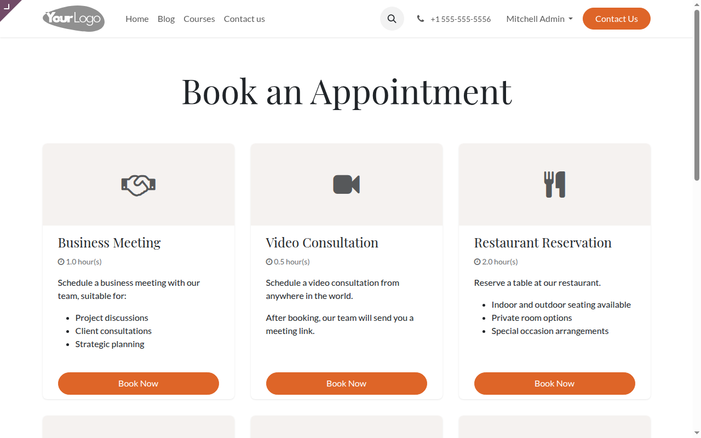
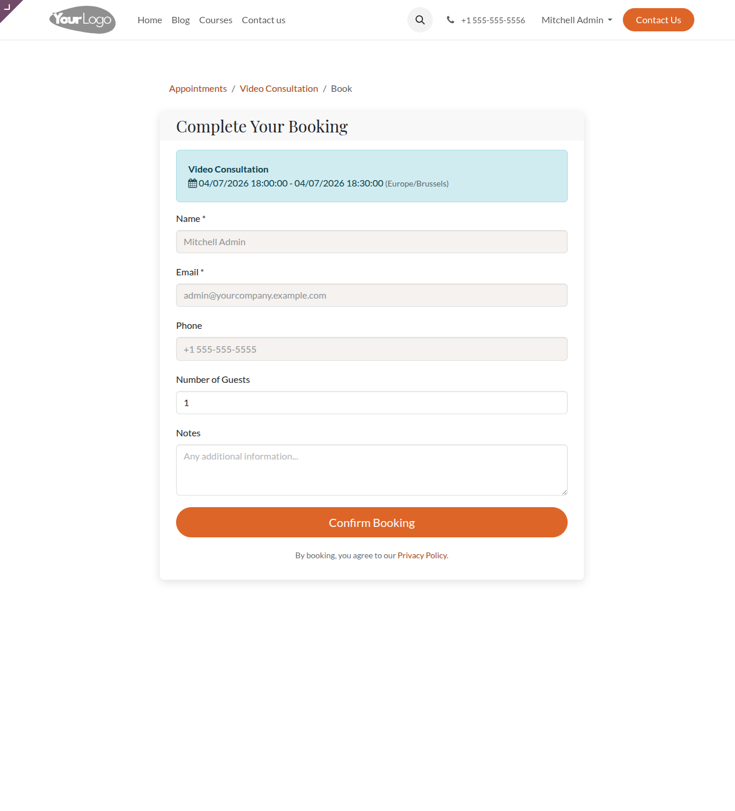
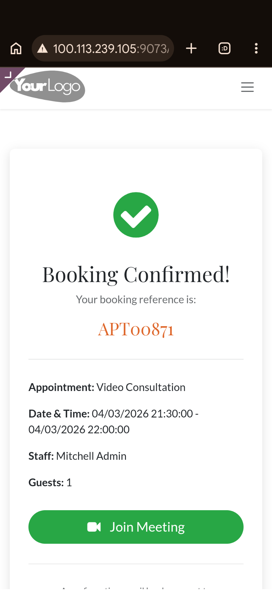
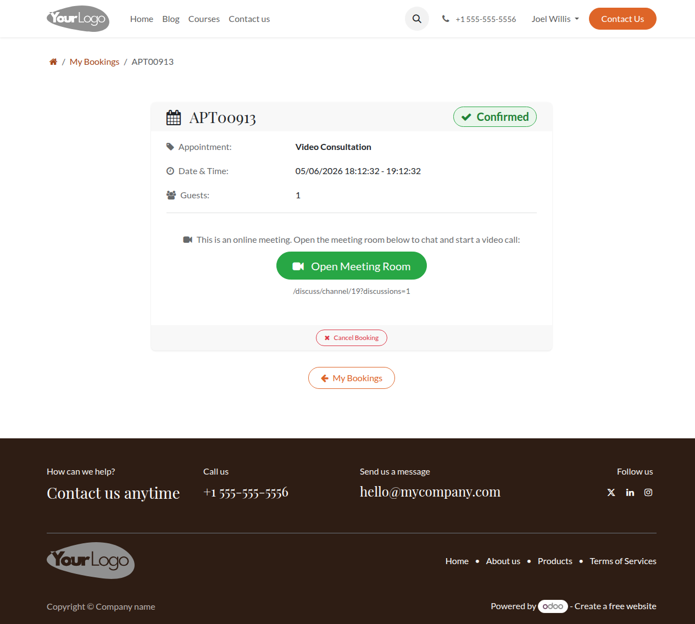
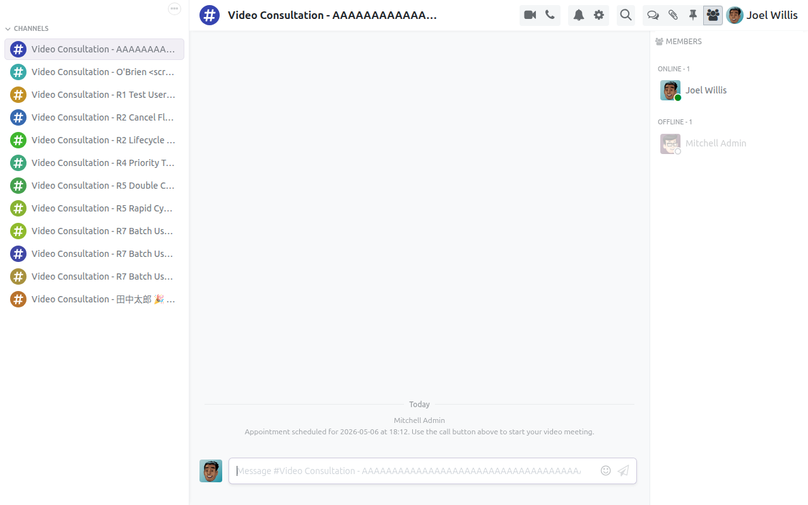
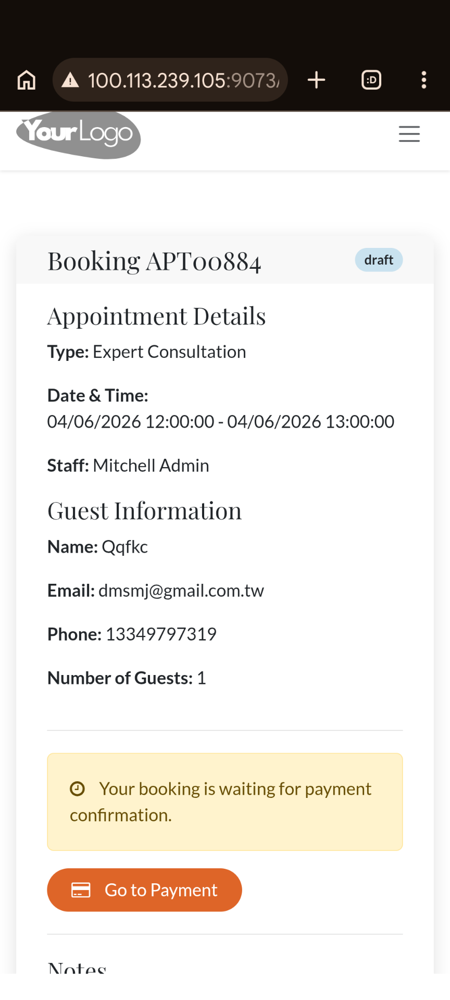

<p align="center">
  
</p>

<h1 align="center">Reservation Booking Enhancement</h1>

<p align="center">
  <strong>Complete Appointment Booking System for Odoo 18 Community Edition</strong><br/>
  Online booking portal, payment integration, Discuss channel meeting rooms, and multi-language support
</p>

<p align="center">
  <a href="#features">Features</a> &bull;
  <a href="#architecture">Architecture</a> &bull;
  <a href="#screenshots">Screenshots</a> &bull;
  <a href="#appointment-types">Appointment Types</a> &bull;
  <a href="#installation">Installation</a> &bull;
  <a href="#configuration">Configuration</a> &bull;
  <a href="#security">Security</a> &bull;
  <a href="README_zh-TW.md">中文文件</a>
</p>

<p align="center">
  
  
  
  
  
</p>

---

## Overview

**Reservation Booking Enhancement** is a complete appointment booking system for Odoo 18 Community Edition. It brings the functionality of Odoo Enterprise's Appointment module to the Community edition — online booking portal, resource management, payment processing, Discuss channel meeting rooms, and multi-language support.

### Why This Module?

| Challenge | Solution |
|-----------|----------|
| Odoo CE lacks an appointment booking system | Full-featured booking with 6 appointment types |
| Online booking requires custom development | Ready-to-use public booking portal at `/appointment` |
| Meeting rooms need third-party tools | Built-in Discuss channel integration with video call support |
| Resource scheduling is manual | Automated availability management for staff, rooms, and equipment |
| Payment collection is separate | Integrated Odoo payment providers with per-guest pricing |
| Customer portal has no booking management | Portal dashboard with booking history, details, and cancellation |

---

## Features

### Appointment Management

- **6 Appointment Types** — Meetings, video calls, table bookings, resource reservations, paid consultations, and paid seats
- **Resource & Staff Scheduling** — Manage availability of rooms, tables, equipment, and staff with weekly schedules
- **Automatic Confirmation** — Auto-confirm bookings based on capacity rules and availability
- **Cancellation Policies** — Configurable cancellation deadlines with grace periods
- **FAQ / Q&A Support** — Add questions and answers to each appointment type

### Online Booking Portal

- **Public Booking Pages** — Beautiful `/appointment` listing page with appointment type cards
- **Step-by-Step Booking** — Date selection → staff choice → time slot → guest form → confirmation
- **Responsive Design** — Mobile-friendly booking flow with modern CSS styling
- **Guest Information** — Collect name, email, phone, number of guests, and custom notes
- **Capacity Validation** — Enforce maximum capacity per time slot across all bookings

### Payment Integration

- **Odoo Payment Providers** — Works with all Odoo payment providers (Stripe, PayPal, etc.)
- **Per-Guest Pricing** — Price per person with automatic total calculation
- **Payment-Required Flow** — Draft bookings until payment confirmed, then auto-confirm
- **Free & Paid Types** — Support both free and paid appointment types in the same system

### Discuss Channel Meeting Rooms

- **Auto-Created Channels** — Confirm an online meeting → Discuss channel is created automatically
- **Video Call Support** — Meeting URL generated and shared with customers via email
- **Portal Access** — Customers join meeting rooms directly from their portal booking page
- **Member Management** — Staff and customers auto-added to the channel with correct access rights

### Customer Portal

- **My Bookings Dashboard** — Portal users see all their bookings with status, type, and date
- **Booking Detail Page** — Complete booking information with "Open Meeting Room" and "Cancel Booking" actions
- **My Discussions** — Central hub for all meeting room channels accessible from the portal
- **Status Tracking** — Real-time booking status (Draft, Confirmed, Cancelled)

### Email Notifications

- **Confirmation Emails** — Automatic emails with booking details, meeting links, and calendar attachment
- **Reminder System** — Configurable email reminders before appointments
- **Meeting URL Included** — Online meeting bookings include the Discuss channel URL in all emails

### Multi-Language Support

- **English** — Full interface and email templates
- **Traditional Chinese (zh_TW)** — Complete translation for Taiwan market
- **Simplified Chinese (zh_CN)** — Complete translation for China market
- **Extensible** — Standard Odoo `.po` translation format for easy additions

---

## Architecture

```
┌──────────────────────────────────────────────────────────────────┐
│               Reservation Booking Enhancement                     │
│                  (reservation_module)                              │
├──────────────────────────────────────────────────────────────────┤
│                                                                   │
│  ┌─────────────────┐  ┌─────────────────┐  ┌─────────────────┐   │
│  │  Backend Views   │  │  Website Portal  │  │ Customer Portal │   │
│  │                  │  │                  │  │                 │   │
│  │ • Type Kanban    │  │ • /appointment   │  │ • My Bookings   │   │
│  │ • Booking List   │  │ • Date Picker    │  │ • Booking Detail│   │
│  │ • Booking Form   │  │ • Time Slots     │  │ • My Discussions│   │
│  │ • Calendar View  │  │ • Booking Form   │  │ • Cancel Action │   │
│  │ • Gantt View     │  │ • Confirmation   │  │ • Meeting Room  │   │
│  └────────┬─────────┘  └────────┬─────────┘  └────────┬────────┘   │
│           │                     │                      │           │
│           └──────────┬──────────┘──────────────────────┘           │
│                      │                                             │
│  ┌───────────────────▼────────────────────────────────────────┐   │
│  │                     Models Layer                            │   │
│  │                                                             │   │
│  │  appointment.type          appointment.booking               │   │
│  │  ├── name, description     ├── name, email, phone            │   │
│  │  ├── location_type         ├── appointment_type_id            │   │
│  │  ├── slot_duration         ├── slot_id, staff_user_id         │   │
│  │  ├── price, payment_required ├── state (draft/confirmed/...)  │   │
│  │  ├── max_capacity          ├── discuss_channel_id             │   │
│  │  └── question_ids          └── payment_transaction_id         │   │
│  │                                                             │   │
│  │  appointment.slot           appointment.question              │   │
│  │  ├── start_datetime         ├── name, answer                  │   │
│  │  ├── end_datetime           └── appointment_type_id           │   │
│  │  └── appointment_type_id                                     │   │
│  │                                                             │   │
│  │  appointment.availability   resource.resource                 │   │
│  │  ├── day_of_week            ├── name                          │   │
│  │  ├── hour_from/hour_to      ├── resource_type                 │   │
│  │  └── appointment_type_id    └── user_id                       │   │
│  └─────────────────────────────────────────────────────────────┘   │
│                      │                                             │
│  ┌───────────────────▼────────────────────────────────────────┐   │
│  │                   Controllers                               │   │
│  │                                                             │   │
│  │  /appointment              → Appointment listing             │   │
│  │  /appointment/<id>         → Appointment detail              │   │
│  │  /appointment/<id>/book    → Date & time selection           │   │
│  │  /appointment/<id>/submit  → Booking submission              │   │
│  │  /my/bookings              → Portal booking list             │   │
│  │  /my/booking/<id>          → Portal booking detail           │   │
│  │  /my/booking/<id>/cancel   → Cancel booking                  │   │
│  │  /my/discussions           → Portal discussions              │   │
│  └─────────────────────────────────────────────────────────────┘   │
│                                                                   │
├───────────────────────────────────────────────────────────────────┤
│                         Odoo 18 Framework                          │
│  Calendar │ Resource │ Website │ Portal │ Payment │ Mail │ Sale   │
├───────────────────────────────────────────────────────────────────┤
│                    PostgreSQL Database                              │
└───────────────────────────────────────────────────────────────────┘
```

### Module Dependency Graph

```
reservation_module
    │
    ├── calendar     (Odoo Calendar - event management)
    ├── resource     (Resource Management - staff & room scheduling)
    ├── website      (Website Builder - public booking pages)
    ├── portal       (Customer Portal - My Bookings dashboard)
    ├── payment      (Payment Engine - Stripe, PayPal, etc.)
    ├── mail         (Discuss / Email - channel creation, notifications)
    ├── sale         (Sales - payment transaction integration)
    └── product      (Product - appointment type pricing)
```

### Booking Flow

```
┌───────────────────────────────────────────────────────────────────┐
│                     Online Booking Flow                            │
│                                                                   │
│  1. Customer visits /appointment                                  │
│     └── Lists all published appointment types                     │
│                                                                   │
│  2. Selects an appointment type                                   │
│     └── Shows description, duration, "Book Now" button            │
│                                                                   │
│  3. Picks a date and (optionally) a staff member                  │
│     └── Calendar widget + staff dropdown                          │
│                                                                   │
│  4. Chooses a time slot                                           │
│     └── Available slots based on staff schedule & capacity        │
│                                                                   │
│  5. Fills in guest information                                    │
│     └── Name, email, phone, # guests, notes                      │
│                                                                   │
│  6a. FREE appointment → Booking confirmed immediately             │
│      ├── Confirmation email sent                                  │
│      ├── Calendar event created                                   │
│      └── (If online) Discuss channel created + meeting URL        │
│                                                                   │
│  6b. PAID appointment → Booking in "Draft" status                 │
│      ├── "Go to Payment" button shown                             │
│      ├── Payment processed via Odoo payment provider              │
│      └── On payment success → auto-confirm + email + channel      │
│                                                                   │
│  7. Customer manages booking from portal                          │
│     ├── View booking details                                      │
│     ├── Open meeting room (for online meetings)                   │
│     └── Cancel booking (if within cancellation deadline)          │
└───────────────────────────────────────────────────────────────────┘
```

---

## Screenshots

### Backend — Appointment Types Kanban

Manage all appointment types from a visual kanban view. Each card shows the type name, icon, and published status.

<p align="center">
  
</p>

### Backend — Appointment Type Configuration

Configure each type with staff assignment, location type (Online Meeting / Physical), timezone, video link, and scheduling rules.

<p align="center">
  
</p>

### Backend — Appointment Options Tab

Set booking options: payment settings (price per person, payment requirement), slot duration, advance booking limits, and cancellation policies.

<p align="center">
  
</p>

### Backend — All Bookings List

View all bookings with reference number, customer name, appointment type, date/time, status, and assigned staff.

<p align="center">
  
</p>

### Backend — Booking Form Detail

Complete booking details: customer info, appointment details, Discuss channel meeting URL, and status tracking in chatter.

<p align="center">
  
</p>

### Backend — Confirmation Email

Automatic confirmation email sent to customers with booking details, meeting links, and calendar information.

<p align="center">
  
</p>

### Online Booking — Appointment List

Customers visit `/appointment` to browse all published appointment types with descriptions and durations.

<p align="center">
  
</p>

### Online Booking — Appointment Detail

Appointment detail page with description, duration info, and "Book Now" button.

<p align="center">
  
</p>

### Online Booking — Date & Staff Selection

Calendar-based date picker with optional staff member selection dropdown.

<p align="center">
  
</p>

### Online Booking — Time Slot Selection

Available time slots displayed based on staff schedule, existing bookings, and capacity limits.

<p align="center">
  
</p>

### Online Booking — Guest Information Form

Fill in name, email, phone, number of guests, and notes. Paid appointments show a payment alert.

<p align="center">
  
</p>

### Online Booking — Confirmation Page

Booking confirmed with reference number, details, and "Join Meeting" button for online appointments.

<p align="center">
  
</p>

### Online Booking — Join Meeting

Online meeting confirmation with "Join Meeting" button linking directly to the Discuss channel.

<p align="center">
  
</p>

### Portal — Home Dashboard

Logged-in customers see "My Bookings" and "Discussions" links in their portal dashboard.

<p align="center">
  
</p>

### Portal — My Bookings

Booking list with reference number, type, date/time, and status (Confirmed, Cancelled, etc.).

<p align="center">
  
</p>

### Portal — Booking Detail

Full booking details with status badge, "Open Meeting Room" button, and "Cancel Booking" action.

<p align="center">
  
</p>

### Portal — My Discussions

Central hub for all Discuss channels — meeting rooms are accessible from the portal.

<p align="center">
  
</p>

### Discuss — Automatic Channel Creation

Online meeting bookings auto-create Discuss channels with the appointment type name and booking reference.

<p align="center">
  
</p>

### Discuss — Portal Meeting Room

Customers access the Discuss channel from their portal with real-time messaging and video call buttons.

<p align="center">
  
</p>

### Payment — Pending Payment

Paid bookings are created in "Draft" status with a "Go to Payment" button and payment pending alert.

<p align="center">
  
</p>

---

## Appointment Types

| Type | Description | Use Case |
|------|-------------|----------|
| **Meeting** | Book time with staff members | Consultations, interviews, 1-on-1 sessions |
| **Video Call** | Virtual meeting with auto-created Discuss channel | Remote consultations, telemedicine, online tutoring |
| **Table Booking** | Reserve tables at venues | Restaurants, bars, co-working spaces |
| **Resource Booking** | Book rooms, courts, or equipment | Meeting rooms, sports courts, rental equipment |
| **Paid Consultation** | Paid time slots with professionals | Legal advice, medical consultations, coaching |
| **Paid Seat** | Per-person booking with payment | Events, workshops, theater, group tours |

---

## Installation

### Prerequisites

- **Odoo 18.0** Community Edition
- **PostgreSQL 13+**
- **Python 3.10+**

### Step 1: Deploy Module

```bash
# Clone the repository
git clone https://github.com/WOOWTECH/Odoo_reservation_module.git

# Copy to Odoo addons path
cp -r Odoo_reservation_module/reservation_module /path/to/odoo/addons/

# Update module list & install
./odoo-bin -u reservation_module -d your_database
```

### Step 2: Install in Odoo

1. Go to **Apps** menu
2. Click **Update Apps List**
3. Search for **"Reservation Booking Enhancement"**
4. Click **Install**

### Step 3: Configure Payment (Optional)

If you need paid appointments:

1. Go to **Invoicing > Configuration > Payment Providers**
2. Enable and configure your preferred provider (Stripe, PayPal, etc.)
3. The module will automatically use configured payment providers for paid appointment types

---

## Configuration

### 1. Create Appointment Types

Navigate to **Calendar > Appointments**

1. Click **Create** to add a new appointment type
2. Set the **Name**, **Description**, and **Appointment Category** (Meeting, Video Call, Table, Resource, Paid Consultation, Paid Seat)
3. Choose **Location Type**: Physical, Online Meeting, or Customer's Location
4. Assign **Staff Members** who can handle this appointment type
5. Toggle **Allow Customer to Choose Staff** if desired

### 2. Configure Availability

On the appointment type form, go to the **Availability** tab:

1. Add weekly availability rules (day of week + hour range)
2. Set **Slot Duration** (e.g., 30 min, 1 hour)
3. Configure **Min/Max Advance Booking** windows
4. Set **Maximum Capacity** per slot (for table/resource bookings)

### 3. Configure Payment Options

On the **Options** tab:

1. Toggle **Payment Required** for paid types
2. Set **Price per Person** (or fixed price)
3. Link to a **Product** for sales order generation
4. Configure cancellation deadline

### 4. Configure Discuss Integration

For online meeting types:

1. Set **Location Type** to "Online Meeting"
2. (Optional) Set a **Video Conference Link** for the meeting URL
3. The system auto-creates Discuss channels on booking confirmation
4. Portal users are automatically added to their booking's channel

### 5. Add FAQ / Q&A

On the **Questions** tab:

1. Add common questions with their answers
2. These are displayed on the public booking page

### 6. Publish

Toggle the **Published** switch to make the appointment type visible at `/appointment`.

---

## Security

### Access Control Groups

| Group | Access Level |
|-------|-------------|
| **Public** | View published appointment types, submit bookings |
| **Portal** | View own bookings, access own Discuss channels, cancel own bookings |
| **User** | View all bookings, manage own appointments |
| **Manager** | Full CRUD on all bookings, appointment types, and settings |

### Permission Model

```
┌────────────────────────────────────────────────────────┐
│                 Access Control Matrix                    │
│                                                         │
│  appointment.type                                       │
│  ├── Public:  Read (published only via website)         │
│  ├── Portal:  Read                                      │
│  ├── User:    Read / Write                              │
│  └── Manager: Read / Write / Create / Delete            │
│                                                         │
│  appointment.booking                                    │
│  ├── Public:  Create (via website form)                 │
│  ├── Portal:  Read own / Cancel own                     │
│  ├── User:    Read all / Write own                      │
│  └── Manager: Full CRUD                                 │
│                                                         │
│  appointment.slot                                       │
│  ├── Public:  Read (available slots only)               │
│  ├── Portal:  Read                                      │
│  ├── User:    Read / Write                              │
│  └── Manager: Full CRUD                                 │
│                                                         │
│  resource.resource                                      │
│  ├── User:    Read                                      │
│  └── Manager: Full CRUD                                 │
└────────────────────────────────────────────────────────┘
```

### Security Features

- **Record Rules** — Users can only view/modify bookings based on their group
- **Portal Isolation** — Portal users see only their own bookings and channels
- **CSRF Protection** — All form submissions include CSRF tokens
- **Payment Validation** — Server-side payment verification before confirming paid bookings
- **Discuss Channel Restriction** — Only online meeting bookings create channels; members restricted to booking parties

---

## Dependencies

| Module | Type | Description |
|--------|------|-------------|
| `calendar` | Core | Calendar event management |
| `resource` | Core | Staff and resource scheduling |
| `website` | Core | Public booking pages |
| `portal` | Core | Customer portal dashboard |
| `payment` | Core | Payment provider integration |
| `mail` | Core | Discuss channels and email notifications |
| `sale` | Core | Sales order integration for paid bookings |
| `product` | Core | Appointment type pricing |

All dependencies are **standard Odoo 18 CE modules** — no third-party modules required.

---

## Changelog

### v18.0.2.1.0 (2026-04)

- **Feature:** Discuss channel integration for online meeting bookings — auto-created channels with portal access
- **Feature:** "My Discussions" portal page for centralized meeting room access
- **Feature:** Video conference link support in appointment types and confirmation emails
- **Fix:** Resolved 500 error on booking form caused by non-existent `max_guests` field
- **Fix:** Restricted Discuss channel creation to online meeting bookings only
- **Fix:** Set portal group access for Discuss channel members
- **i18n:** Complete zh_TW and zh_CN translations matching the current `.pot` template

### v18.0.2.0.0 (2026-03)

- **Feature:** Payment integration with per-guest pricing and draft-until-paid flow
- **Feature:** Customer portal with "My Bookings" dashboard and booking detail pages
- **Feature:** Email confirmation with meeting links and calendar attachments
- **Feature:** FAQ/Q&A support for appointment types
- **Feature:** Cancellation policies with configurable deadlines

### v18.0.1.0.0 (2026-03)

- **Initial Release:** Complete appointment booking system with 6 appointment types
- **Feature:** Online booking portal with step-by-step flow
- **Feature:** Resource and staff scheduling with weekly availability
- **Feature:** Automatic confirmation based on capacity rules
- **Feature:** Backend management views (kanban, list, form, calendar, gantt)

---

## Support

- **Website:** [aiot.woowtech.io](https://aiot.woowtech.io/)
- **Email:** [support@woowtech.com](mailto:support@woowtech.com)
- **Issues:** [GitHub Issues](https://github.com/WOOWTECH/Odoo_reservation_module/issues)

---

## License

This project is licensed under **LGPL-3** (GNU Lesser General Public License v3).

See [LICENSE](https://www.gnu.org/licenses/lgpl-3.0.html) for details.

---

<p align="center">
  <sub>Built by <a href="https://github.com/WOOWTECH">WOOWTECH</a> &bull; Powered by Odoo 18 Community Edition</sub>
</p>
