# Reservation Booking Enhancement / 預約管理系統

**Version: 18.0.2.1.0** | **Odoo 18 Community Edition** | **License: LGPL-3**

A complete appointment booking system for Odoo 18 Community Edition with online booking portal, payment integration, Discuss channel meeting rooms, and multi-language support.

適用於 Odoo 18 社群版的完整預約管理系統，支援線上預約、付款整合、Discuss 頻道會議室及多語言。

---

## Table of Contents / 目錄

- [Features / 功能特色](#features--功能特色)
- [Screenshots / 操作截圖](#screenshots--操作截圖)
  - [Backend Management / 後台管理](#backend-management--後台管理)
  - [Online Booking Flow / 線上預約流程](#online-booking-flow--線上預約流程)
  - [Customer Portal / 客戶入口](#customer-portal--客戶入口)
  - [Discuss Channel Integration / Discuss 頻道整合](#discuss-channel-integration--discuss-頻道整合)
  - [Payment Flow / 付款流程](#payment-flow--付款流程)
- [Appointment Types / 預約類型](#appointment-types--預約類型)
- [Installation / 安裝方式](#installation--安裝方式)
- [Configuration / 設定](#configuration--設定)
- [Dependencies / 相依模組](#dependencies--相依模組)
- [Support / 技術支援](#support--技術支援)

---

## Features / 功能特色

- **Multiple Appointment Types / 多種預約類型**: Meetings, video calls, table bookings, resource reservations, paid consultations, and paid seats
- **Resource & Staff Management / 資源與員工管理**: Manage availability of rooms, tables, equipment, and staff members
- **Online Booking Portal / 線上預約入口**: Beautiful public-facing booking pages with date/time selection
- **Payment Integration / 付款整合**: Collect payments upfront with Odoo's payment providers (supports per-guest pricing)
- **Discuss Channel Meeting Rooms / Discuss 頻道會議室**: Auto-created chat channels for online meeting bookings with video call support
- **Auto Confirmation / 自動確認**: Automatically confirm bookings based on capacity rules
- **Email Notifications / 電子郵件通知**: Automatic confirmation and reminder emails with meeting links
- **Customer Portal / 客戶入口**: Customers can view, manage, and cancel bookings from their portal
- **Multi-language Support / 多語言支援**: English, Traditional Chinese (zh_TW), Simplified Chinese (zh_CN)

---

## Screenshots / 操作截圖

### Backend Management / 後台管理

#### Appointment Types Kanban / 預約類型看板

Manage all your appointment types from a visual kanban view. Each card shows the appointment name, type icon, and published status.

從看板檢視管理所有預約類型，每張卡片顯示預約名稱、類型圖示及發佈狀態。

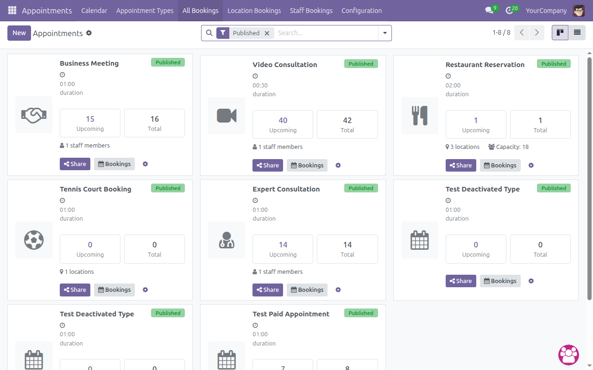

#### Appointment Type Configuration / 預約類型設定

Configure each appointment type with staff assignment, location type (Online Meeting / Physical), timezone, and video link settings.

設定每種預約類型的員工分配、地點類型（線上會議/實體）、時區及視訊連結。

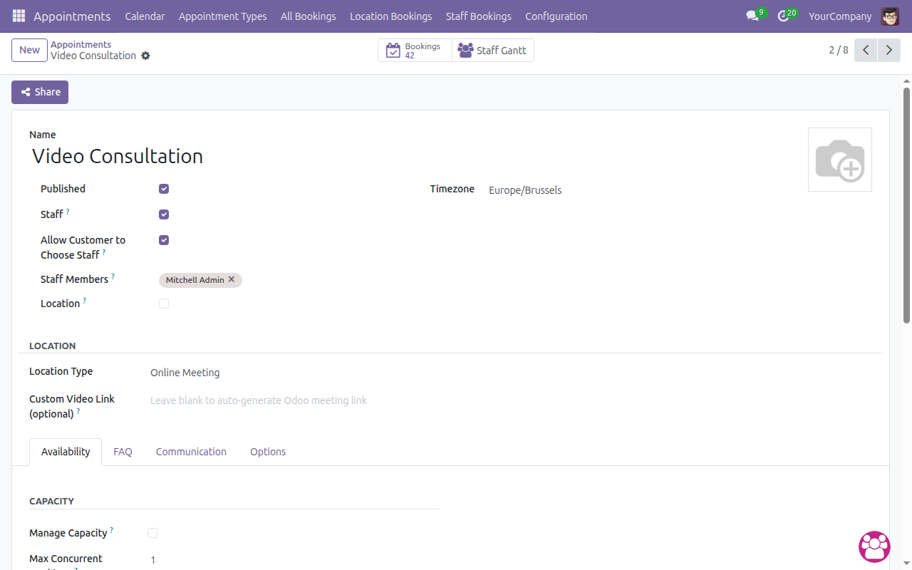

#### Appointment Options Tab / 預約選項頁籤

Configure booking options including payment settings (price per person, payment requirement), scheduling rules (slot duration, advance booking limits), and cancellation policies.

設定預約選項，包括付款設定（每人價格、是否需付款）、排程規則（時段長度、預約限制）及取消政策。

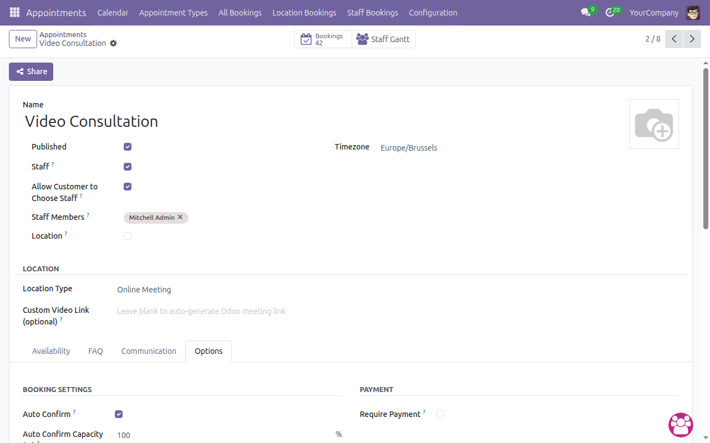

#### All Bookings List / 所有預約列表

View all bookings in a comprehensive list with booking reference, customer name, appointment type, date/time, status, and assigned staff.

以完整列表檢視所有預約，包含預約編號、客戶姓名、預約類型、日期時間、狀態及指派員工。

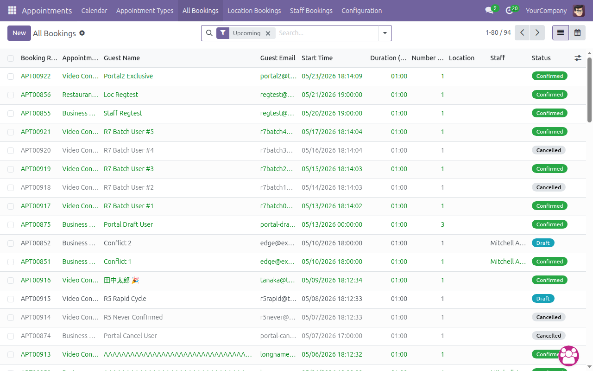

#### Booking Form Detail / 預約表單詳情

View complete booking details including customer information, appointment details, discuss channel meeting URL, and status tracking.

檢視完整預約詳情，包括客戶資訊、預約細節、Discuss 頻道會議連結及狀態追蹤。

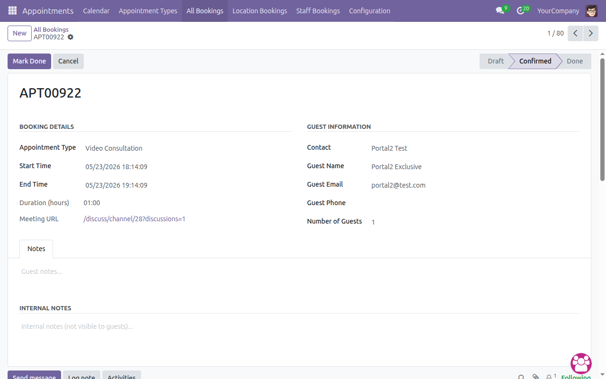

#### Booking Confirmation Email / 預約確認信件

The chatter shows automatic confirmation emails sent to customers with booking details and meeting links.

聊天記錄顯示自動發送給客戶的確認郵件，包含預約詳情及會議連結。

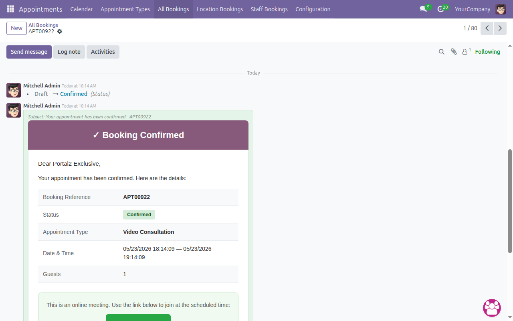

---

### Online Booking Flow / 線上預約流程

#### Step 1: Appointment List Page / 步驟一：預約列表頁面

Customers visit `/appointment` to see all published appointment types with descriptions.

客戶訪問 `/appointment` 查看所有已發佈的預約類型及說明。

#### Step 2: Appointment Detail / 步驟二：預約詳情頁面

Select an appointment type to see its description, duration, and a "Book Now" button to start booking.

選擇預約類型查看說明、時長，並點擊「立即預約」開始預約。

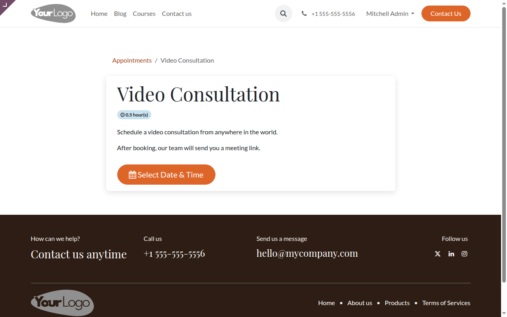

#### Step 3: Date & Staff Selection / 步驟三：日期與員工選擇

Choose a date from the calendar and optionally select a preferred staff member from the dropdown.

從日曆選擇日期，並可從下拉選單選擇偏好的員工。

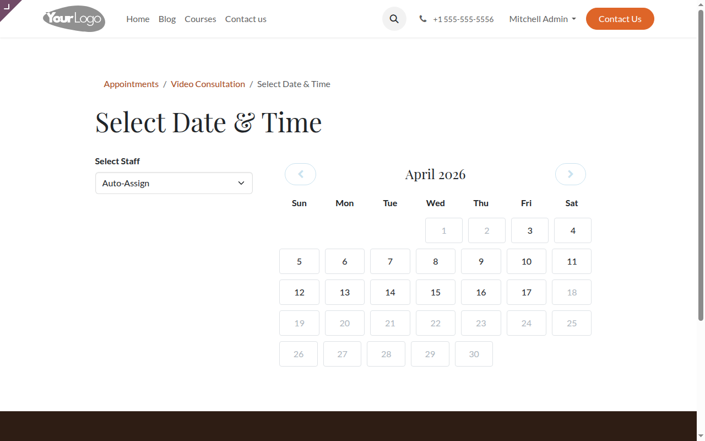

#### Step 4: Time Slot Selection / 步驟四：時段選擇

Available time slots are displayed based on staff availability and existing bookings. Slots are shown in the configured interval (e.g., 30 minutes).

根據員工可用時間及現有預約顯示可用時段。時段按設定的間隔顯示（例如 30 分鐘）。

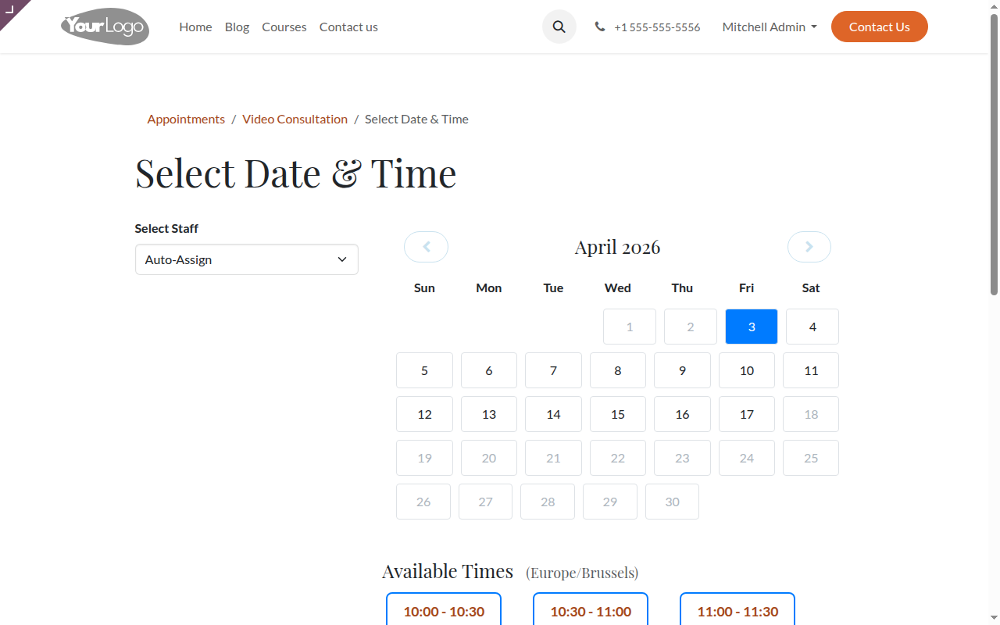

#### Step 5: Booking Form / 步驟五：預約表單

Fill in guest information including name, email, phone, number of guests, and optional notes. For paid appointments, a payment alert is shown.

填寫賓客資訊，包括姓名、電子郵件、電話、賓客人數及備註。付費預約會顯示付款提示。

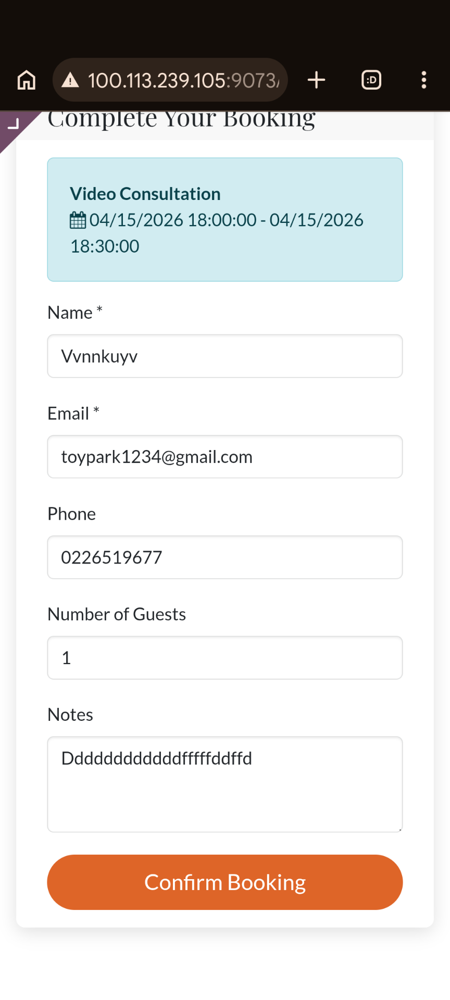

#### Step 6: Booking Confirmed / 步驟六：預約確認

After successful booking, a confirmation page shows the booking reference, appointment details, and a notification that confirmation email has been sent. For online meetings, a "Join Meeting" button links to the Discuss channel.

預約成功後，確認頁面顯示預約編號、預約詳情，及確認郵件已發送的通知。線上會議預約會顯示「加入會議」按鈕連結至 Discuss 頻道。

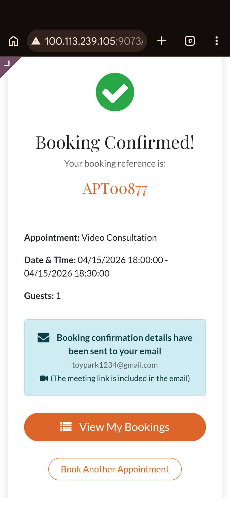

#### Booking Confirmed with Join Meeting / 預約確認含加入會議

For online meeting bookings, the confirmation page includes a "Join Meeting" button that opens the Discuss channel for video calls and chat.

線上會議預約的確認頁面包含「加入會議」按鈕，可開啟 Discuss 頻道進行視訊通話和聊天。

---

### Customer Portal / 客戶入口

#### Portal Home / 入口首頁

Logged-in customers see "My Bookings" and "Discussions" links in their portal dashboard.

已登入的客戶在入口儀表板看到「我的預約」和「討論」連結。

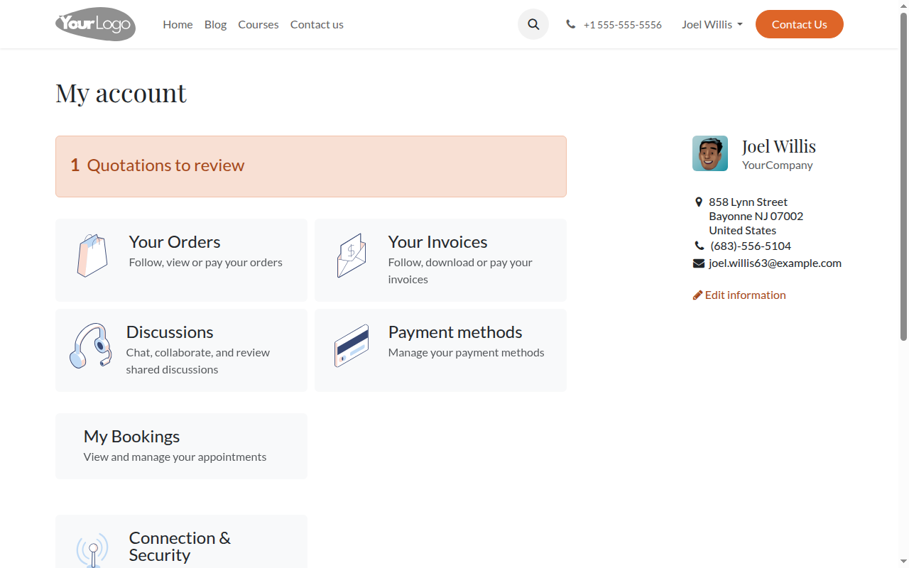

#### My Bookings List / 我的預約列表

View all bookings with reference number, appointment type, date/time, and status (Confirmed, Cancelled, etc.).

檢視所有預約，包含預約編號、預約類型、日期時間及狀態（已確認、已取消等）。

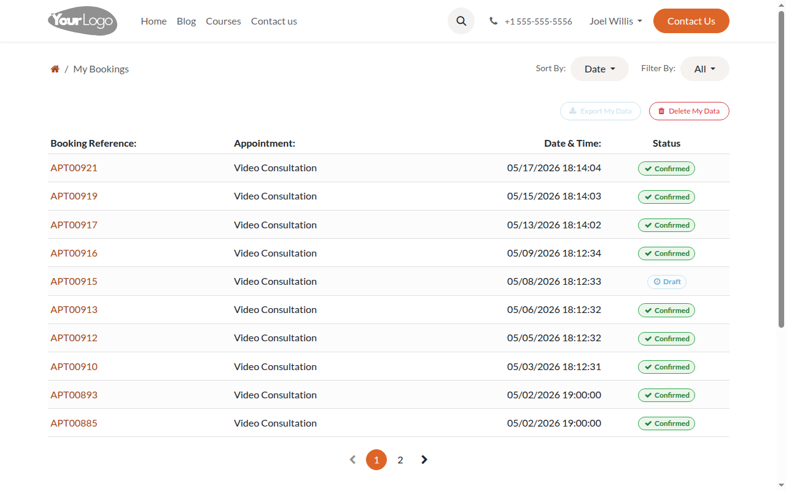

#### Booking Detail / 預約詳情

View booking details with status badge, appointment information, date/time, guest count. For online meetings, an "Open Meeting Room" button links to the Discuss channel. A "Cancel Booking" option is also available.

檢視預約詳情，包含狀態徽章、預約資訊、日期時間、賓客人數。線上會議預約顯示「開啟會議室」按鈕連結至 Discuss 頻道。也提供「取消預約」選項。

#### My Discussions / 我的討論

Portal users can access all their Discuss channels from the "My Discussions" page, providing a central hub for meeting room communication.

入口用戶可從「我的討論」頁面存取所有 Discuss 頻道，作為會議室溝通的中心樞紐。

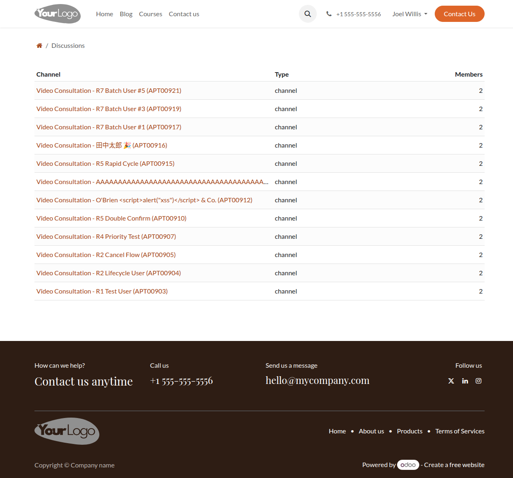

---

### Discuss Channel Integration / Discuss 頻道整合

#### Automatic Channel Creation / 自動建立頻道

When an online meeting booking is confirmed, a Discuss channel is automatically created. The channel includes the appointment type name and booking reference (e.g., "Video Consultation - Customer Name (APT00903)").

當線上會議預約確認時，系統自動建立 Discuss 頻道。頻道包含預約類型名稱和預約編號（例如「Video Consultation - 客戶名稱 (APT00903)」）。

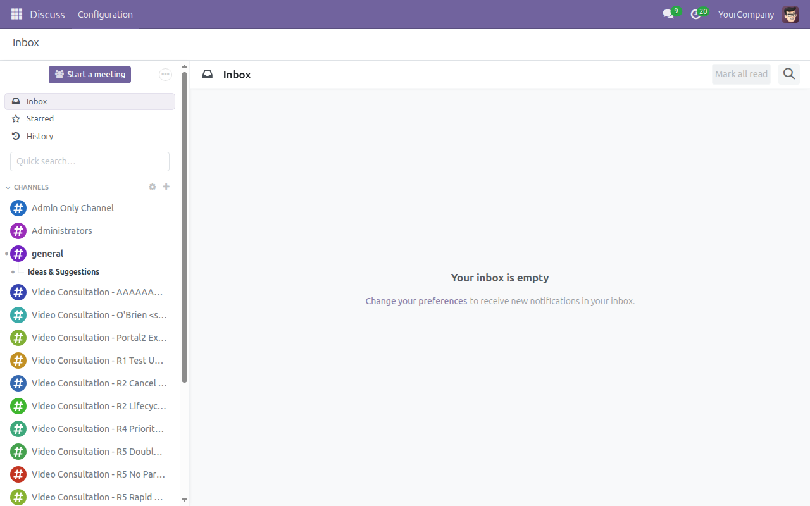

#### Portal Discuss Channel / 入口 Discuss 頻道

Customers access the Discuss channel through their portal booking detail page. The channel provides real-time messaging, video call buttons, and member presence indicators.

客戶從入口預約詳情頁面存取 Discuss 頻道。頻道提供即時通訊、視訊通話按鈕及成員在線狀態指示。

---

### Payment Flow / 付款流程

#### Payment Pending / 等待付款

For paid appointment types, bookings are created in "draft" status with a "Go to Payment" button. The page shows appointment details, guest information, and a payment pending alert.

付費預約類型的預約以「草稿」狀態建立，並顯示「前往付款」按鈕。頁面顯示預約詳情、賓客資訊及等待付款提示。

---

## Appointment Types / 預約類型

| Type / 類型 | Description / 說明 | Use Case / 使用情境 |
|------|-------------|----------|
| Meeting / 會議 | Book time with staff members / 與員工預約時間 | Consultations, interviews / 諮詢、面試 |
| Video Call / 視訊通話 | Virtual meeting with Discuss channel / 含 Discuss 頻道的虛擬會議 | Remote consultations / 遠端諮詢 |
| Table Booking / 餐桌預訂 | Reserve tables at restaurants / 預訂餐廳桌位 | Restaurants, bars / 餐廳、酒吧 |
| Resource Booking / 資源預訂 | Book rooms, courts, equipment / 預訂房間、場地、設備 | Meeting rooms, sports facilities / 會議室、運動設施 |
| Paid Consultation / 付費諮詢 | Paid time slots with professionals / 與專業人士的付費時段 | Legal, medical consultations / 法律、醫療諮詢 |
| Paid Seat / 付費座位 | Per-person booking with payment / 按人數收費的預約 | Events, theaters, tours / 活動、劇院、旅遊 |

---

## Installation / 安裝方式

1. Copy the `reservation_module` folder to your Odoo addons directory / 將 `reservation_module` 資料夾複製到 Odoo 附加模組目錄
2. Update the apps list in Odoo / 在 Odoo 中更新應用程式列表
3. Install "Reservation Booking Enhancement" from the Apps menu / 從應用程式選單安裝「Reservation Booking Enhancement」

## Configuration / 設定

1. Go to **Reservation > Appointments** to create appointment types / 前往 **預約 > 預約類型** 建立預約類型
2. Configure availability schedules (weekly schedule with day/time ranges) / 設定可用時間表（每週排程含日期/時間範圍）
3. Add staff members and configure "Allow Customer to Choose Staff" / 新增員工並設定「允許客戶選擇員工」
4. Set location type: Physical, Online Meeting, or Customer's Location / 設定地點類型：實體、線上會議或客戶地點
5. Configure payment options if required (price per person, payment required) / 如需要設定付款選項（每人價格、是否需付款）
6. Set scheduling rules: slot duration, booking window, cancellation deadline / 設定排程規則：時段長度、預約窗口、取消期限
7. Publish appointment types to make them available at `/appointment` / 發佈預約類型使其在 `/appointment` 上可用

## Dependencies / 相依模組

- `calendar` - Odoo Calendar (core)
- `resource` - Resource Management (core)
- `website` - Website Builder (core)
- `payment` - Payment Engine (core)
- `mail` - Discuss / Email (core)
- `sale` - Sales (core, for paid appointments)
- `portal` - Customer Portal (core)

## License / 授權條款

LGPL-3

## Support / 技術支援

For support, please contact us at [support@woowtech.com](mailto:support@woowtech.com) or visit [woowtech.com](https://aiot.woowtech.io/)

如需支援，請聯繫 [support@woowtech.com](mailto:support@woowtech.com) 或訪問 [woowtech.com](https://aiot.woowtech.io/)

---

© 2026 WoowTech. All rights reserved.
